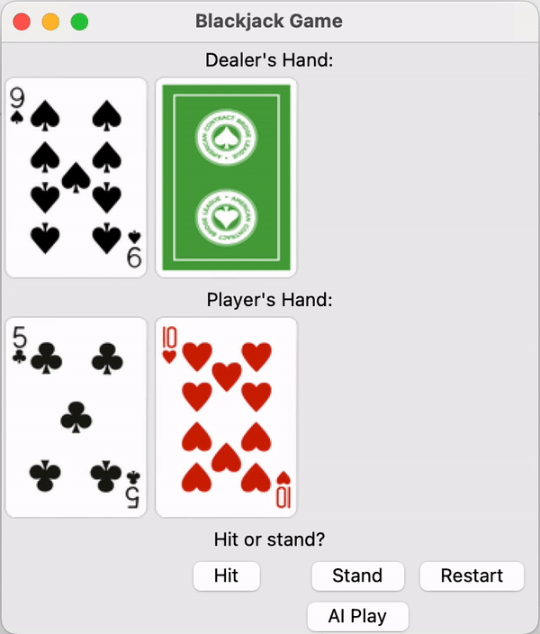
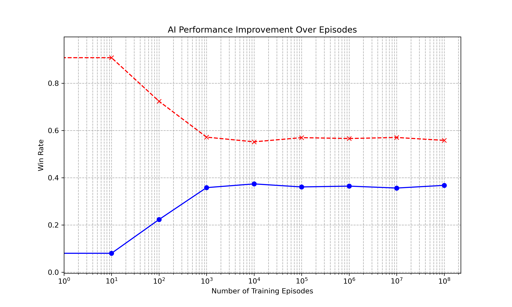
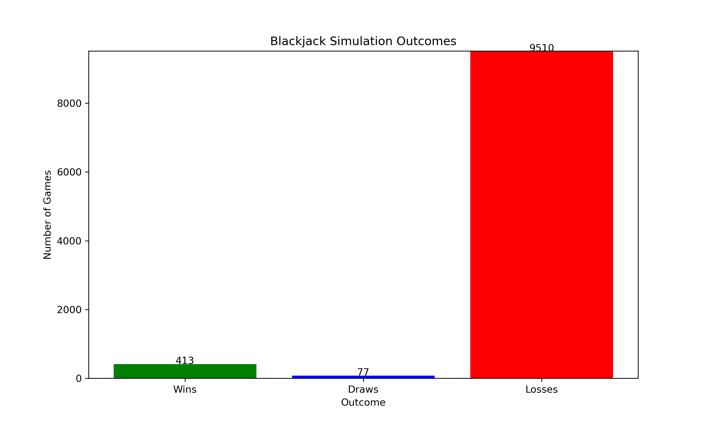
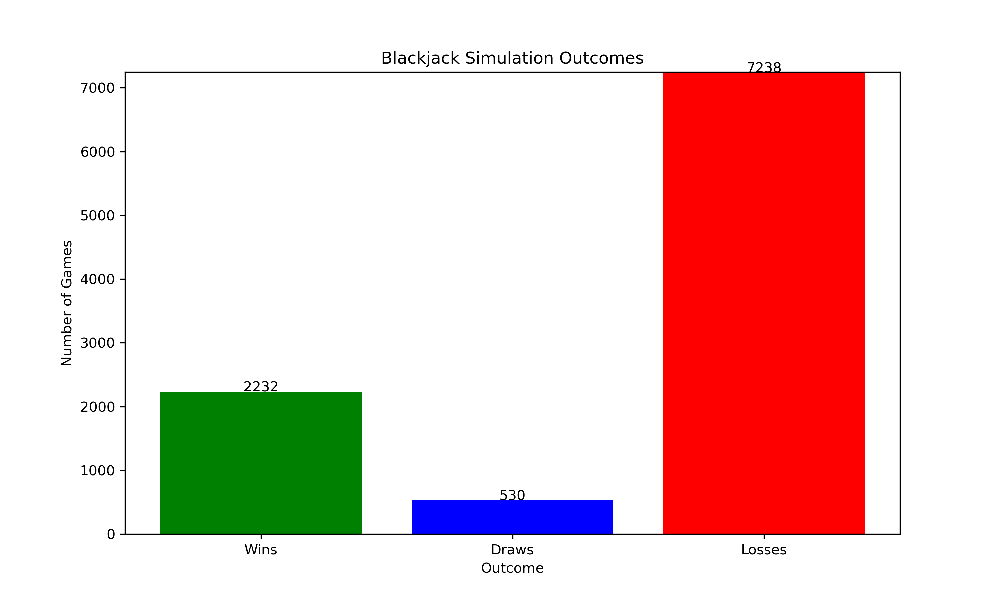
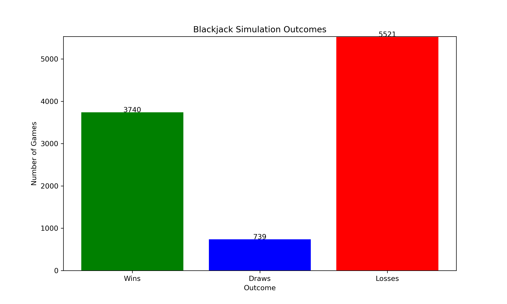
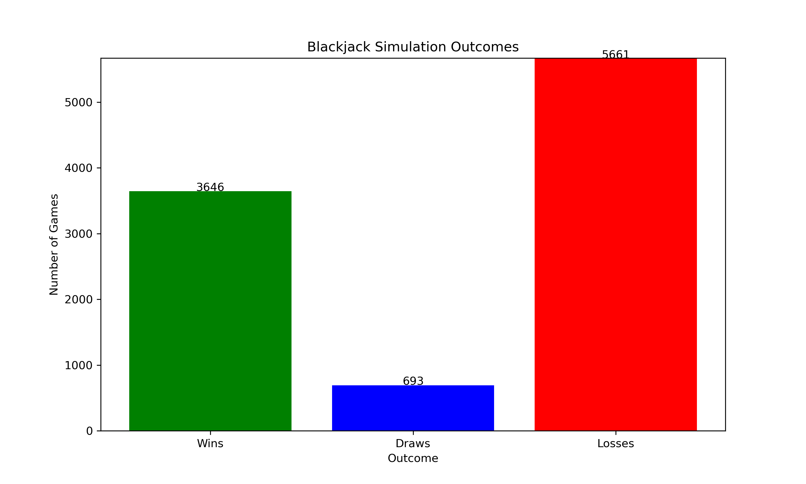

# Blackjack-Simulation

This project is a comprehensive simulation of the game of Blackjack, designed to explore and optimize different strategies using Q-learning algorithms. It includes a detailed implementation of the game's rules as well as an AI that learns to play Blackjack through reinforcement learning techniques.


## Table of Contents

- [Features](#features)
- [Installation](#installation)
- [Project Structure](#project-structure)
- [Usage](#usage)
- [Results](#results)
- [Contributing](#contributing)
- [License](#license)

## Features

The Blackjack Simulation offers a comprehensive suite of features designed to simulate and analyze Blackjack strategies using advanced AI techniques. Here are some of the standout features of this project:

### Comprehensive Game Rules Implementation
- **Blackjack Rules**: The game accurately implements standard Blackjack rules including hitting, standing.
- **Realistic Dealer Logic**: The dealer follows the standard casino protocol, such as hitting on 16 and standing on 17.

### Advanced AI Gameplay
- **Q-Learning AI**: Utilizes a Q-learning algorithm to learn optimal strategies over time.
- **Pre-Trained Models**: Comes with models that have already been trained over thousands of game iterations, allowing for immediate deployment and testing of strategies.
- **Custom AI Training**: Users can train their own models using customizable settings, such as learning rate and discount factor, to potentially discover new winning strategies.

### User Interface
- **Graphical User Interface**: An interactive GUI that allows users to play against the AI or watch the AI play, enhancing the understanding of different strategies.
- **Command-Line Interface**: For those who prefer it, a CLI version is available, offering detailed logs of game progress and decisions.

### Analytical Tools
- **Performance Analysis**: Includes scripts for analyzing and visualizing the AI's decision-making process and performance, providing insights into how strategies develop over time.
- **Win/Loss Metrics**: Tracks performance metrics such as win rate, loss rate, and draw rate across different simulation runs.

### Extensibility and Customization
- **Modular Design**: The software is designed with modularity in mind, allowing developers to easily extend or modify components such as the AI algorithms, game rules, or UI.
- **Configuration Files**: Users can alter various aspects of the simulation through configuration files, making it flexible to different needs or experimental setups.

### Documentation and Support
- **Detailed Documentation**: Comprehensive documentation is provided to help users get started quickly and to understand the complex functionalities of the game.
- **Community Support**: The project encourages all contributions from all commnuities.

## Installation

To set up the Blackjack simulation on your local machine, follow these steps:

```bash
git clone https://github.com/ACM40960/Blackjack-Simulation.git
cd Blackjack-Simulation
conda env create -f environment.yml
conda activate blackjack-env
```

## Project Structure

```bash
Blackjack-Simulation/
│
├── ai_models/             # Trained AI models and data
│   ├── ...
├── images/                # Images and figures used or produced by the project
│   ├── ...
├── results/               # Output results and datasets
│   ├── ...
├── eval/                  # Scripts for evaluation of simulation results
│   ├── analysis_plot.py   # Script for plotting analysis results
│   └── simulate.py        # Script for running simulations
│
├── src/                   # Source files containing the main application logic
│   ├── __init__.py        # Python Package
│   ├── agent.py           # Defines the AI agent
│   ├── card.py            # Card class for handling playing cards
│   ├── deck.py            # Deck class for handling decks of cards
│   ├── game.py            # Core game logic
│   ├── gameGUI.py         # Graphical user interface for the game
│   ├── hand.py            # Hand class for handling cards in a hand
│   ├── main.py            # Entry point of the program
│   └── train.py           # Training routines for the AI
│
├── .gitignore             # Specifies intentionally untracked files to ignore
├── environment.yml        # Conda environment file
├── LICENSE                # License details
├── literature_review.pdf  # Background literature review document
└── README.md              # Project overview and instructions
```

## Usage

This section explains how to run the Blackjack simulation program and use its features effectively.

### Running the Simulation

To start a simulation, follow these steps:

1. **Activate the Environment**: Make sure the `blackjack-env` is activated:
   ```bash
   conda activate blackjack-env
   ```
2. **Run the simulation**: Execute the main script to start the simulation:
   ```bash
   python src/main.py
   ```
   You can choose the pre-trained AI model by directly modifing the `q_table_filename` parameter in the main script before running it.

   - **Gameplay**
     - **Dealer's Hand**: The dealer's initial hand will be displayed at the top with one card face down and one card face up.
     - **Player's Hand**: Your hand is displayed openly at the bottom.
   - **Options**
     - **Hit**: The dealer's initial hand will be displayed at the top with one card face down and one card face up.
     - **Stand**: Click the `Hit` button to draw another card.
     - **Restart**: Resets the game to start a new round.
     - **AI Play**: Allows the AI to play the game automatically based on the trained model.

   - **Demo**
<div align="center">
  
</div>
    
4. **(Optional)Retrain your own model**: Customize `train.py` by adjusting the configuration settings:

   Here are the main options you can configure:
  
   - **q_table_filename**: Specifies the path to a pre-trained Q-table. Set this to `None` to start training from scratch.
   - **num_states**: Defines the size of the state space that the AI agent considers. It's a tuple representing the dimensions of the Q-table.
   - **num_actions**: The number of possible actions the AI can take in any given state.
   - **learning_rate**: Determines how much new information overrides old information. Higher values make the agent learn faster but can lead to unstable training.
   - **discount_factor**: Indicates how much future rewards are valued over immediate rewards. Closer to 1 means the agent values future rewards more highly.
   - **exploration_rate**: The probability of the agent choosing a random action over the best-known action. This helps the agent explore new actions rather than exploiting known strategies.
   
   To modify these settings, locate where the `BlackjackAI` instance in `train.py` is created and adjust the parameters accordingly. For example:
    
   ```python
   ai_agent = BlackjackAI(
       q_table_filename='ai_models/pretrained_model.npy',
       num_states=(31, 31),
       num_actions=2,
       learning_rate=0.1,
       discount_factor=0.95,
       exploration_rate=0.1
   )

## Results

Our Blackjack Simulation utilizes AI to learn and optimize strategies over multiple episodes. Below, we present a series of results that illustrate the AI's learning progression and decision-making effectiveness over time. These insights are critical for understanding the impact of different training durations and settings on AI performance.

### AI Performance Improvement Over Episodes

This plot shows the AI's win rate and loss rate over a logarithmic scale of training episodes:



- **Observations**:
  - The win rate stabilizes after around 10,000 episodes, indicating that additional training yields diminishing returns.
  - Loss rates decrease initially but plateau, suggesting the AI reaches a strategy limitation under current configurations.

### Detailed Game Outcomes

We also analyze the game outcomes in terms of wins, losses, and draws. The following plots show these metrics after different simulation runs:

#### Simulation Outcomes After no Episodes (Benchmark)



#### Simulation Outcomes After 100 Episodes



- The increase in the number of losses correlates with a more aggressive strategy adopted by the AI as it explores more state-action pairs.

#### Simulation Outcomes After 10,000 Episodes



- An increase in wins and a decrease in draws suggest an improvement in strategic decision-making by the AI.

#### Simulation Outcomes After 1,000,000 Episodes



- The improvement of performance is limited over this stage, implying that the AI reaches a strategy limitation under current configurations.


### Analysis and Discussion

The collected data demonstrate that while the AI significantly improves with initial training, there's a plateau effect in performance improvement. This is aligned with the the expectation in Blackjack, which, even with perfect play, is often below 50% due to the house edge.

## Contributing

We warmly welcome contributions from the community and are delighted to see interest in improving and expanding this Blackjack simulation project. Whether you have suggestions for features, code improvements, bug reports, or documentation updates, your input is highly appreciated!

If you have any questions or wish to discuss before making changes, feel free to open an issue on the GitHub repository or contact your GitHub profile name directly through [my profile page](https://github.com/shikanchen).

## License

This project is licensed under the MIT License. Please read [LICENSE](LICENSE) for more details.
